

<!-- PROJECT LOGO -->
 

  

<h3 align="center">ITpt</h3>

  

    ITPT is a fitness tracking website that helps users plan and track their workouts to reach their fitness goals. 
     
    <a href="https://github.com/ong-ck/ITpt"><strong>Explore the docs »</strong></a>
     
     
    <a href="https://itpt-d53e0.web.app/">View Demo</a>
    ·
    <a href="https://github.com/ong-ck/ITpt/issues">Report Bug</a>
    ·
    <a href="https://github.com/ong-ck/ITpt/issues">Request Feature</a>
  

<!-- TABLE OF CONTENTS -->

  
Table of Contents

  <ol>
    <li>
      <a href="#about-the-project">About The Project</a>
      <ul>
        <li><a href="#level-of-achievement">Level of Achievement</a></li>
        <li><a href="#description">Description</a></li>
        <li><a href="#motivation">Motivation</a></li>
        <li><a href="#user-stories">User Stories</a></li>
      </ul>
    </li>
    <li>
      <a href="#system-design">System Design</a>
      <ul>
        <li><a href="#core-features">Core Features</a></li>
        <li><a href="#tech-stack">Tech Stack</a></li>
        <li><a href="#architecture-diagram">Architecture Diagram</a></li>
        <li><a href="#database-structure">Database Structure</a></li>
        <li><a href="#software-engineering-practices">Software Engineering Practices</a></li>
        <li><a href="#mockup">Mockup</a></li>
      </ul>
    </li>
    <li>
    <a href="#usage">Usage</a>
    <ul>
    <li><a href="#technical-proof-of-concept">Technical Proof of Concept</a></li>
    </ul>
    </li>
    <li>
    <a href="#evaluation">Evaluation</a>
    <ul>
	    <li><a href="#testing-plan">Testing Plan</a></li>
        <li><a href="#interpretation-of-results">Interpretation of results</a></li>
    </ul>
    </li>
    <li>
	    <a href="#roadmap">Roadmap</a>
	    <ul>
	    <li><a href="#scope-of-project">Scope of Project</a></li>
        <li><a href="#development-plan">Development Plan</a></li>
        </ul>
    </li>
    <li><a href="#acknowledgments">Acknowledgments</a></li>
  </ol>

<!-- ABOUT THE PROJECT -->
## About The Project

### Level of Achievement

Gemini

### Description

ITPT is a fitness tracking website that targets fitness enthusiasts. To prepare NSman and NSFs for their yearly IPPT, ITPT offers users a personalised training experience where they are able to customise their training plan to fit their fitness level and training tempo. It also features an in-built IPPT score calculator for them to calculate their scores to track their progress.

### Motivation

Many of the males in Singapore are required to take the IPPT annually. Failing to pass your IPPT within the given window will condemn you to 10 mandatory seasons of NS Fitness Improvement Training in addition to missing out on monetary awards. While there are many fitness apps and training programmes online, they are often not tailored for the IPPT. In addition, these apps do not come with an IPPT calculator. Therefore users have to find another website to calculate their IPPT score. For ITPT, we have decided to combine the 2 above to create a fitness training website to prepare users for their IPPT. It would recommend exercises to help users improve their score in each station and have an in-build IPPT calculator for greater convenience. Allowing users to seamlessly transition between planning and tracking their workout.

### User Stories

* 
As an Nsmen with IPPT coming soon, I want to be able to clear my annual IPPT requirement and get the monetary rewards and not have to go for the NS FIT program.

* 
As a student with many commitments, I want a personally curated fitness plan where I can adjust the intensity of my training schedule to be able to keep up with my commitments and still be able to meet my IPPT goals.

* 
As a fitness enthusiast, I want to be able to challenge myself to get a better score for ym IPPT. I want to have a training programme that is specially tailored for IPPT.

(<a href="#top">back to top</a>)

<!-- SYSTEN DESIGN -->
## System Design

### Core Features

* 
<u>Login Feature</u>. A login feature was included to provide users with a personalised planning experience. Users would sign in using their Gmail account by clicking the “Sign in” button. This login feature was implemented using Firebase authentication.

* 
<u>Fully Customizable Training Plan</u>. Users are able to use the calendar in the homepage to plan their workouts. Users can insert a new event by clicking on the desired date and key in the details of the activity. To reschedule the activities, users can simply drag the “event block” to another date. This is implemented using FullCalendar which handles the user interface as well as the creation of event objects.

* 
<u>In-built IPPT Calculator</u>. Users are able to calculate their IPPT scores using the calculator whenever they need. It displays the points breakdown for each exercise, together with the total score and the corresponding achievement. Furthermore, the IPPT calculator provides feedback to the users on the number of additional reps needed/ amount of time to cut for them to improve their score for each station by one point.

* 
<u>Gamification</u>. Points will be given after the users complete each of the activities that set for themselves, with which they can purchase avatars to customise their profile page. As such, users can be incentivised to work towards their fitness goals as they seek to gather customizable items purchasable by their collected points.

### Tech Stack

* <a href="https://html.spec.whatwg.org/">HTML</a>/<a href="https://www.w3.org/TR/CSS/#css">CSS</a>/<a href="http://www.ecma-international.org/publications-and-standards/standards/ecma-262/">JS</a>
	* HTML will be used to produce the frontend UI of the website
	* [Bootstrap](https://getbootstrap.com)
		* Provides the design components used in the website
	* Javascript Libraries
		* [JQuery](https://jquery.com)
			* Program the interactions between the frontend UI with the user, producing the UX of the website
		* <a href="https://fullcalendar.io/">FullCalendar</a>/<a href="https://momentjs.com/">Moment.js</a>
			* 
FullCalendar library is used to implement the basic features of our fitness planning function. It provides us with the basic UI for the calendar and allows users to easily create and manipulate event objects when inserting their workout plan into the calendar.

			* Moment.js library is used to manipulate the formats of the dates in the event objects generated in the FullCalendar library.
* [Firebase](https://firebase.google.com/)
	* 
Firebase Authentication will be used to implement the login feature of the website, letting users login to the website using their google accounts.

	* 
Firebase Cloud Firestore will be used as the database of the website, storing the user data (such as the calendar events). This allows for a customised experience for the users.

### Architecture Diagram

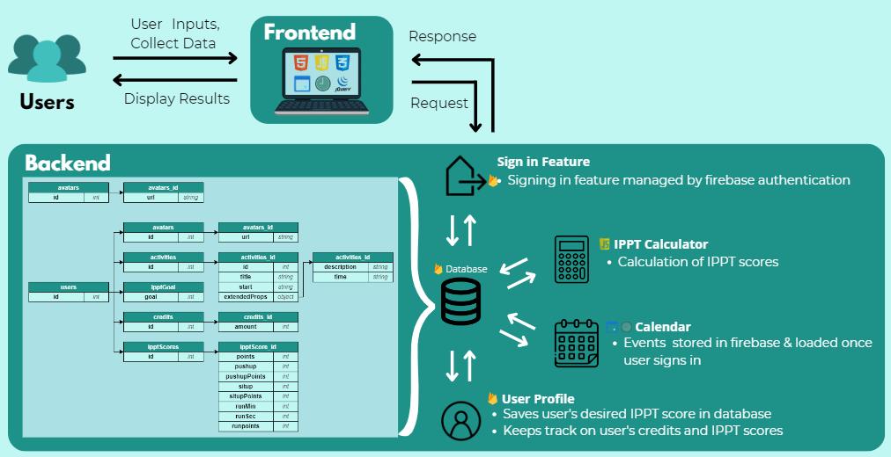

### Database Structure

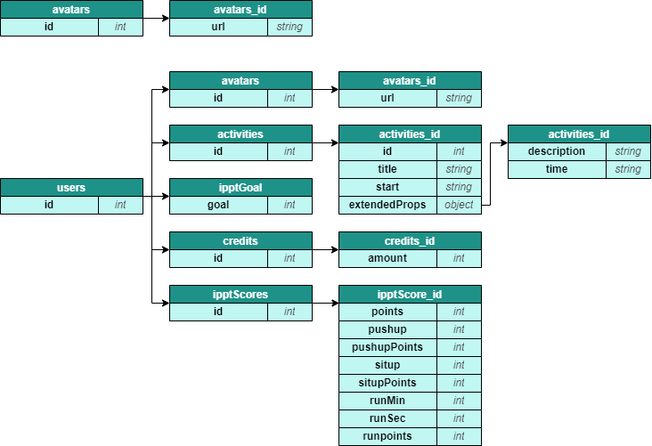

### Software Engineering Practices

* Version Control
	* 
Changes to the source code are tracked and managed through the use of Github. Storing the source code in a remote repository allows us to work separately on different features, while maintaining the original version of the source code.

	* 
New features implemented are pushed into a different branch to be deconflicted before merging into the main branch for the website to update.

* Code Organisation
	* 
Codes are organised by components to reduce complexity and allowing for easier debugging. This also enhances readability of the code.

* Coding Standards
	* 
HTML, JavaScript and CSS codes were written with reference to <a href="https://www.w3schools.com">w3schools</a>. Following proper standards when writing code allows us to ensure code readability and efficiency.

* Code Documentation
	* 
Source code written for the website are documented following the JSDoc 3 Standards to ensure that we will be able to understand the code, thus allowing us to be able to maintain and develop the code efficiently.

* Git Issues
	* 
Problems and updates related to the project were added as an issue in Git Issues. The issues added were labelled based on the type. Assignees were also assigned to each issue to distribute the work needed for greater efficiency.

	* 
Milestones were also set to contain the issues and provide a deadline for the issues to be resolved in time.

* Continuous Integration / Continuous Development (CI/CD) Pipeline
	* 
Web application is automatically tested and deployed using Github Actions whenever a new commit/merge occurs. This ensures that the web application is running properly whenever a new update is implemented.

### Mockup

 
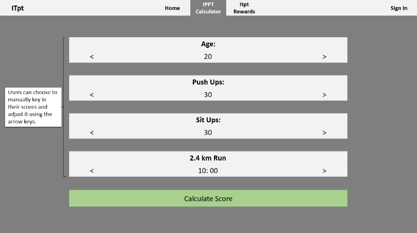 
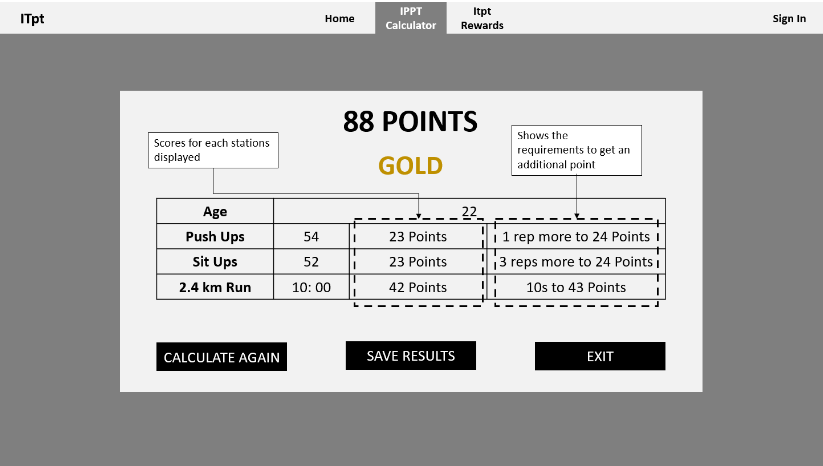 
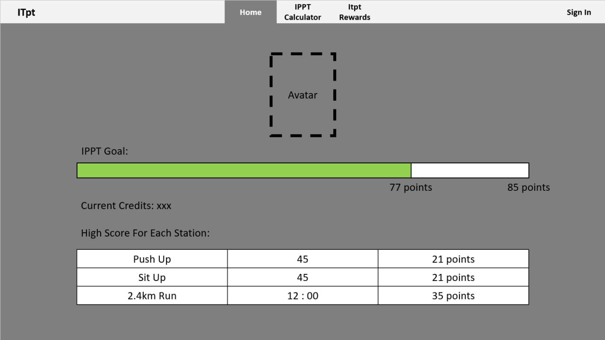

(<a href="#top">back to top</a>)

<!-- USAGE EXAMPLES -->
## Usage

### Technical Proof of Concept

The following are screenshots of the website.

#### Homepage
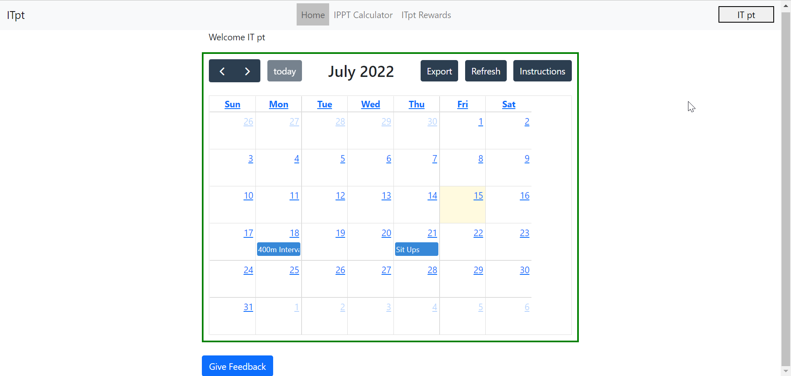 
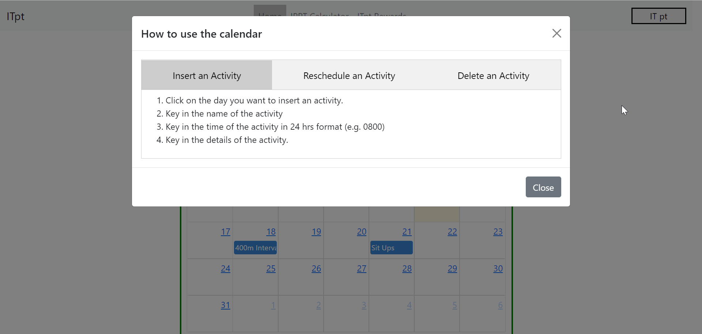 
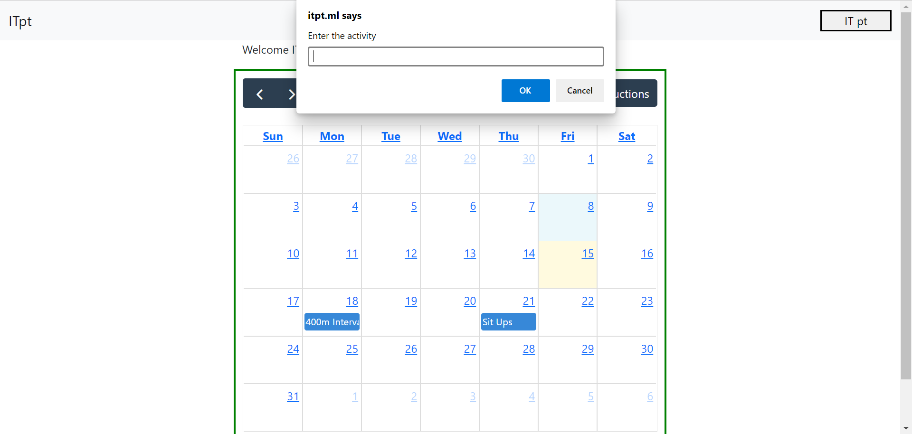 
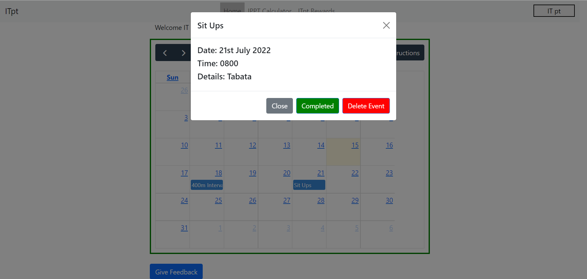 

#### Calculator
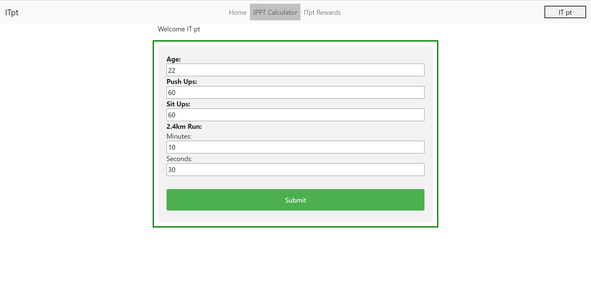 
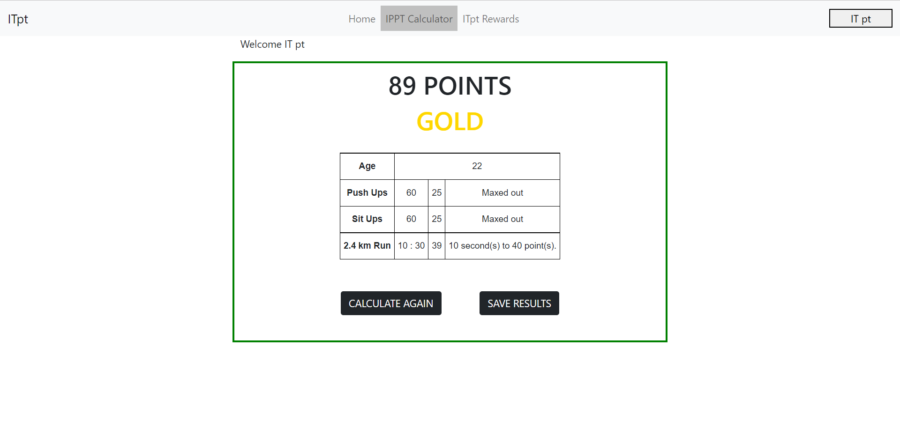 

#### Rewards
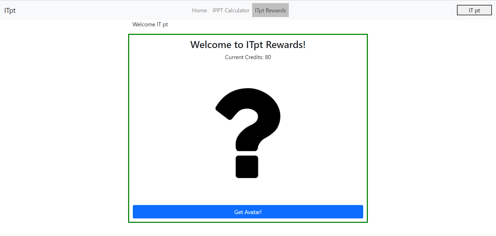 
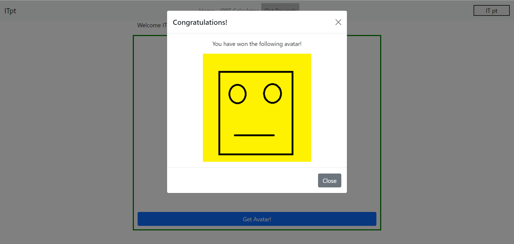 

#### Profile
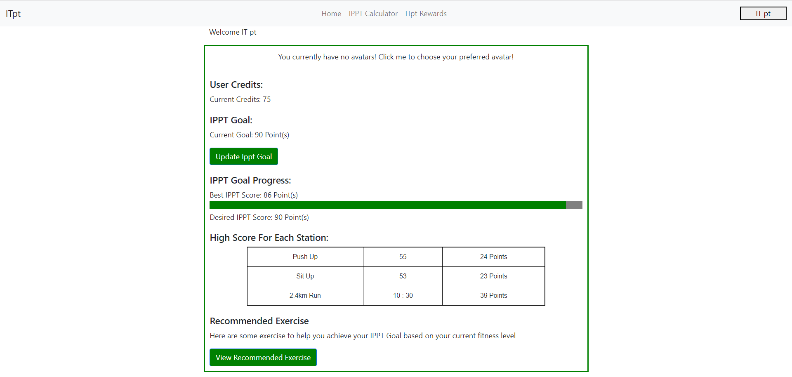 
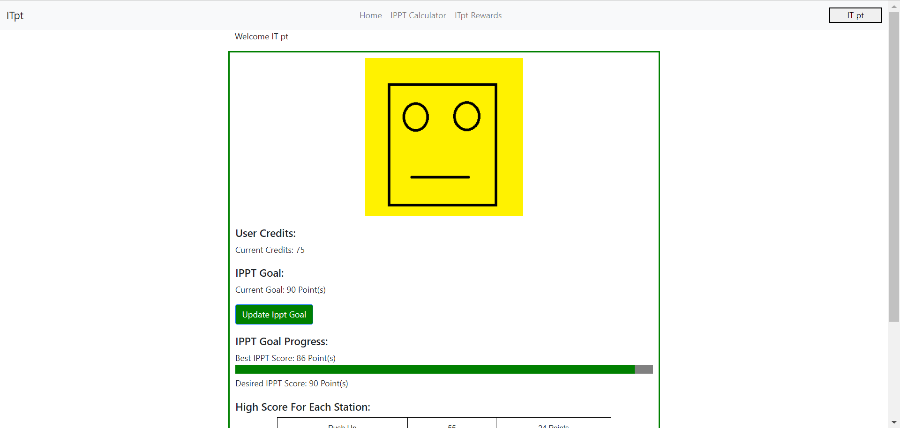 
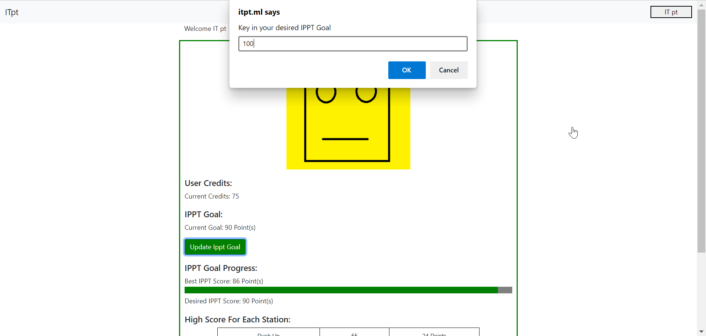 
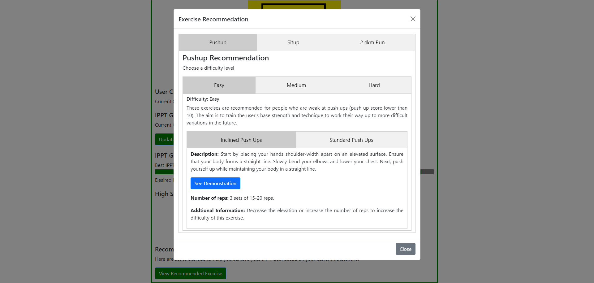 

To access the website, simply go to https://www.itpt.ml (or https://itpt-d53e0.web.app/).

(<a href="#top">back to top</a>)

<!-- EVALUATION-->
## Evaluation

### Testing Plan

#### Introduction

In order to ensure that ITpt is working as intended based on the features proposed, this testing plan is created to ensure that rigorous and structured testing is implemented.

The testing plan specifies the objectives and tasks, scope, testing strategy, test schedule, control procedure, features tested/not tested and tools used to test the website.

#### Objectives and Tasks

The objective of the testing plan is to ensure that the user interface (UI) and user experience (UX) provided by ITpt meets the proposed description and features.

Expected tasks:
* Ensuring that the UI is showing up properly
* Ensuring that navigation within ITpt provides the expected UX
* Ensuring that ITpt is compatible with various browsers
* Ensuring that ITpt is able to perform within expectations with increased user numbers
* Ensuring that all updates to ITpt are tested
* Seeking user opinions for improvements

#### Scope

The testing plan covers the frontend UI and UX and the backend capabilities of ITpt that are in direct interaction with the users.

#### Testing Strategy

* Unit & GUI Testing
	* 
<a href="https://www.cypress.io/">Cypress</a> was used to execute Unit & GUI Testing.

	* 
Testing code is written to check that all elements expected are visible on the webpage and the buttons navigate to the expected locations in the website.

 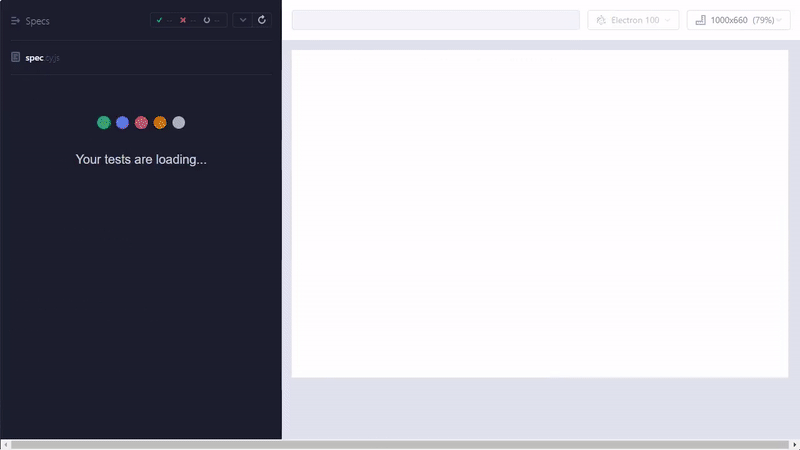

* Compatability Testing
	* 
The website was checked to be working with different browsers. After every update, the website will also be tested to ensure it is still working.

	* 
<a href="https://www.powermapper.com/products/sortsite/checks/browser-compatibility/">PowerMapper</a> was used to determine the compatibility of our website to numerous browsers.

 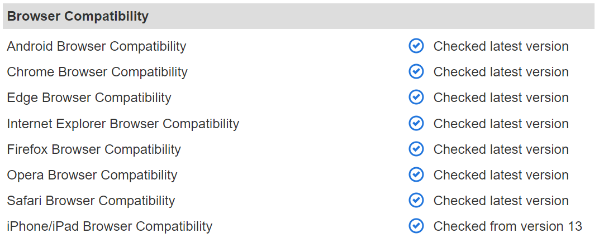

* Volume & Stress Testing
	* 
The website was checked on whether it can handle large amount of data and multiple users concurrently.

	* 
<a href="https://www.webpagetest.org/">Webpagetest</a> was also used to run a performance test on the website.

 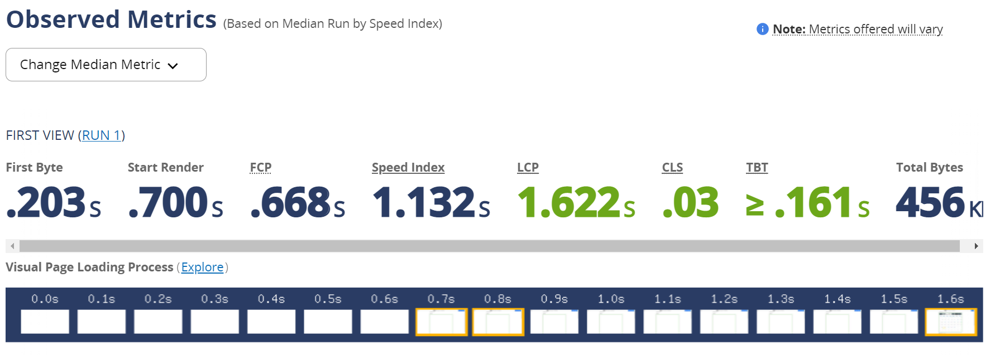

* Regression Testing
	* 
Use of Github Actions to create a Continuous Integration / Continuous Development (CI/CD) Pipeline that continuously test and deploy ITpt whenever a new feature is added

* Usability Testing
	* 
Use of Google Forms to gather feedback from users. The results from the google form can be found <a href="https://docs.google.com/spreadsheets/d/1qMynrZXA_k1VouUbMau5k2STGvG7DffJsFqBFAwsb7s/edit?usp=sharing">here</a>.

#### Test Schedule

<table>
<thead>
  <tr>
    <th>Test Strategy</th>
    <th>Test Frequency</th>
  </tr>
</thead>
<tbody>
  <tr>
    <td>Unit &amp; GUI Testing (together with Regression Testing)</td>
    <td>After every code change</td>
  </tr>
  <tr>
    <td>Compatibility Testing</td>
    <td>After every feature update</td>
  </tr>
  <tr>
    <td>Volume &amp; Stress Testing</td>
    <td>After every feature update</td>
  </tr>
  <tr>
    <td>Usability Testing</td>
    <td>After every milestone feature update</td>
  </tr>
</tbody>
</table>

#### Tools used

* [Cypress](https://www.cypress.io/)
* [PowerMapper](https://www.powermapper.com/products/sortsite/checks/browser-compatibility/)
* [Webpagetest](https://www.webpagetest.org/)
* [Google Forms](https://www.google.com/forms/about/)
* [Github Actions](https://github.com/features/actions)

### Interpretation of results

* Improvements to Fitness Calendar
	* 
The survey indicates that our users are having difficulty with using out fitness planner. Thus we added instructions to the bottom of the page.

* Highlight Important Functionalities
	* 
From the survey, users feel that the more important functions are the Calculator and the monthly view in the Fitness Calendar.

* Improvements to User Interface
	* 
While the general feedback are positive, improvements could be made to the layout of the elements on the page for a better user experience.

* Improvements to User Experience
	* 
The survey indicates that we need to increase the functionalities of the website so that users will be more willing to recommend it to their friends.

(<a href="#top">back to top</a>)

<!-- ROADMAP -->
## Roadmap

### Scope of Project

A Website that helps users plan their fitness schedule to meet their fitness goals easily.

#### Features to be completed by the mid of June

* A Website that the users can access to interact with the features implemented.
	* 
A header bar that contains the links to other pages in the website, also containing the login feature where users can login with their google accounts through a popup.

	* 
A homepage that contains the calendar that allows users to create their exercise plan.

	* 
A calculator page that contains the in-built IPPT calculator that users can use to calculate their IPPT scores on-the-go.

	* 
A rewards page that is part of the gamification feature that will be elaborated further in the section on July features below.

* Login feature powered by Firebase Authentication to allow users to sign in using their Gmail account.

* Fitness Planning feature where users can visualise their workout plan with the calendar.
	* Users can toggle the calendar view between month, week and day by clicking on the respective buttons.
	* To insert an event, users can click on the desired date and key in the details.
	* To view the event details, users can click on the “event block”.
	* They can drag the “event block” around to reschedule their workouts to fit into their personal schedule.
	* They are also able to export the calendar to .ics format to load into their personal calendars.

* IPPT Calculator allows users to gauge their current fitness levels based on the latest IPPT scoring requirements.
	* This calculator also displays the scores for each station.
	* 
Lets the user know the additional requirements to improve their score by 1 point for each station. This will aid users in prioritising which station to focus on to improve their overall score.

#### Features to be completed by the mid of July

* Gamification system. A trust-based, self-governed system that provides additional motivation for the user to meet their fitness goals through the gifting of points that can be used.
	* Reward points will be given to the user every time they complete an exercise in their exercise plan from the calendar.
	* The points given can be used to purchase avatars to customise the user profile.
* User profile
	* Contains general information about the user such as age, gender, name, etc.
	* Contains an avatar that represents the user (can be customised).
	* IPPT Goal setting
		* Users can set their desired ippt score.
		* They can also view their past IPPT scores to track the progress towards the goal.
* Recommended exercises to improve for each station in the IPPT.
	* Users can view a set of exercises to help them improve each station.
	* They can then add them to the calendar.

See the [open issues](https://github.com/ong-ck/ITpt/issues) for a full list of proposed features (and known issues).

### Development Plan

<table>
<tbody>
  <tr>
    <td>Before 15 May</td>
    <td>Finalise techstack to be used, meet up with advisor, work distribution, finalise scope of project. Start on poster and video.</td>
  </tr>
  <tr>
    <td>15 - 21 May</td>
    <td>Finalise poster and video. Create a mock up. Start learning the necessary technologies.</td>
  </tr>
  <tr>
    <td>22 - 28 May</td>
    <td>Learning of necessary technologies. Start implementing basic features of the website. Prepare Milestone 1 submission.</td>
  </tr>
  <tr>
    <td>29 - 30 May</td>
    <td>Refine Milestone 1 submission. Submission of Milestone 1 materials.</td>
  </tr>
  <tr>
    <td>5 - 11 June</td>
    <td>Improve IPPT calculator (shows user amount of reps needed to reach the next point). </td>
  </tr>
  <tr>
    <td>12 - 18 June</td>
    <td>Incorporate exercise recommendations for users to add into the calendar.</td>
  </tr>
  <tr>
    <td>19 - 25 June</td>
    <td>Testing and debugging. Prepare Milestone 2 submission.</td>
  </tr>
  <tr>
    <td>26 - 27 June</td>
    <td>Refine Milestone 2 submission. Submission of Milestone 2 materials.</td>
  </tr>
  <tr>
    <td>28 June - 4 July</td>
    <td>Add gamification system.</td>
  </tr>
  <tr>
    <td>5 - 11 July</td>
    <td>Add user profile view.</td>
  </tr>
  <tr>
    <td>12 - 18 July</td>
    <td>Add exercise recommendation feature.</td>
  </tr>
  <tr>
    <td>19 - 23 July</td>
    <td>Testing and debugging. Prepare Milestone 3 submission.</td>
  </tr>
  <tr>
    <td>24 - 25 July</td>
    <td>Refine Milestone 3 submission. Submission of Milestone 3 materials.</td>
  </tr>
</tbody>
</table>

(<a href="#top">back to top</a>)

<!-- ACKNOWLEDGMENTS -->
## Acknowledgments

* [Readme Template referenced from othneildrew](https://github.com/othneildrew/Best-README-Template)
* [w3schools](https://www.w3schools.com/default.asp)
* [ICS Export Example by Jon Collette](https://codepen.io/jcollette/pen/ErELqY)
* [HubSpot HTML Dropdown Example](https://blog.hubspot.com/website/html-dropdown)
* [Tutorials Point Test Plan Example](https://www.tutorialspoint.com/test-plan-template-sample-document-with-web-application-example)

(<a href="#top">back to top</a>)
